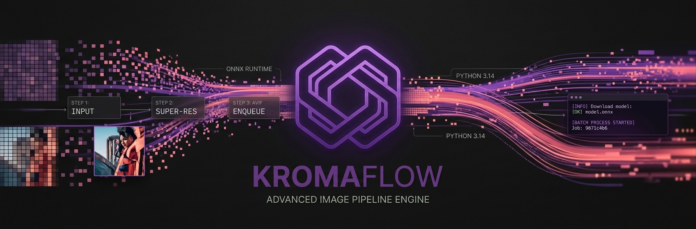
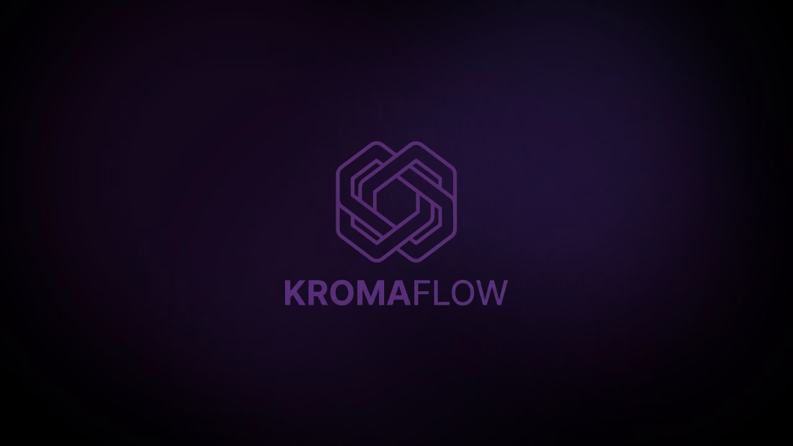
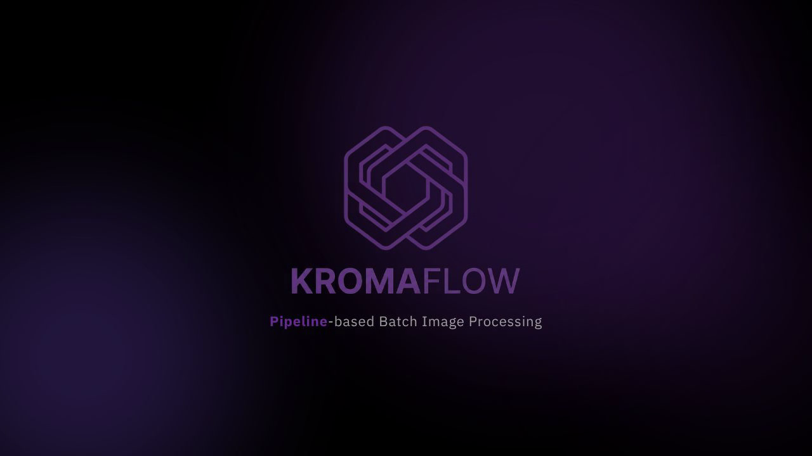

# 🔮 KromaFlow — Advanced Image Pipeline Engine

<p align="center">
  
</p>

<p align="center">
  
  
  
  
  
</p>

<p align="center">
  <a href="README-es.md"><strong>🇪🇸 Versión en español</strong></a>
</p>

---

## 🎬 Demos

<p align="center">
  <table>
    <tr>
      <td align="center"><strong>Wallpaper Upscaling</strong></td>
      <td align="center"><strong>Icon Processing</strong></td>
      <td align="center"><strong>Batch Processing</strong></td>
    </tr>
    <tr>
      <td><a href="https://streamable.com/i80wvx"></a></td>
      <td><a href="https://streamable.com/b7y3z4"></a></td>
      <td><a href="https://streamable.com/2f4yoz"></a></td>
    </tr>
  </table>
</p>

---

## 📖 Installation instructions

> 🧭 **Looking for a step-by-step setup guide?**  
> See [**INSTALLATION.md**](INSTALLATION.md) for detailed instructions on installing KromaFlow on **Windows**, **Linux**, and **macOS**, including system dependencies, GPU setup, and troubleshooting.
>
> 🇪🇸 ¿Prefieres español? Consulta la [**INSTALLATION-es.md**](INSTALLATION-es.md).

---

## 🌌 Overview

**KromaFlow** is a cutting-edge image processing suite that lets you design, visualize, and execute complex image pipelines through an intuitive drag-and-drop editor. Upload your assets, chain operations in seconds, and process massive batches with pixel-perfect precision.

Whether you're a developer automating asset pipelines or a designer needing consistent batch output, KromaFlow gives you the power of production-grade image processing — no CLI gymnastics required.

---

## ⚡ Key Features

<p align="center">
  <table>
    <tr>
      <td align="center" width="33%">🎛️</td>
      <td align="center" width="33%">🧠</td>
      <td align="center" width="33%">🧼</td>
    </tr>
    <tr>
      <td align="center"><strong>Pipeline Editor</strong></td>
      <td align="center"><strong>AI Super-Resolution</strong></td>
      <td align="center"><strong>Smart Watermark Removal</strong></td>
    </tr>
    <tr>
      <td>Design your workflow visually — drag, drop, and reorder processing steps. Fine-tune parameters in real time before you run.</td>
      <td>Upscale images to HD using <strong>Real-ESRGAN</strong> neural networks. Sharp focus, artifact-free, even on complex textures.</td>
      <td>Advanced alpha-channel detection and inverse blending to cleanly remove watermarks, logos, and overlaid text.</td>
    </tr>
    <tr>
      <td align="center" width="33%">📦</td>
      <td align="center" width="33%">🖼️</td>
      <td align="center" width="33%">📊</td>
    </tr>
    <tr>
      <td align="center"><strong>AVIF & Premium Export</strong></td>
      <td align="center"><strong>Background Removal</strong></td>
      <td align="center"><strong>Batch Queue Manager</strong></td>
    </tr>
    <tr>
      <td>Multi-threaded encoding for ultra-compressed <strong>AVIF</strong> and modern formats. Slash file sizes without sacrificing quality.</td>
      <td>Remove backgrounds with <strong>BRIA RMBG-1.4</strong>, a state-of-the-art transformer model running locally via HuggingFace.</td>
      <td>Monitor mass processing with a live progress bar and real-time per-file reports. <em>To Process</em> / <em>Processed</em> at a glance.</td>
    </tr>
    <tr>
      <td align="center" width="33%">🔄</td>
      <td align="center" width="33%">📐</td>
      <td align="center" width="33%">🌐</td>
    </tr>
    <tr>
      <td align="center"><strong>Resize & Adjust</strong></td>
      <td align="center"><strong>SRCSet & Favicons</strong></td>
      <td align="center"><strong>i18n Ready</strong></td>
    </tr>
    <tr>
      <td>Fit, fill, stretch — resize with preset resolutions or custom dimensions. Adjust brightness, contrast, saturation, and sharpness.</td>
      <td>Auto-generate responsive image sets (HTML <code>srcset</code>) and multi-resolution favicon packages for the web.</td>
      <td>Full English and Spanish support built-in. Add more locales effortlessly via i18next.</td>
    </tr>
  </table>
</p>

---

## 🚀 Quick Start

### Prerequisites

- **Python 3.14+** and **Node.js 22+**
- A **HuggingFace token** (for AI models) — [get one free](https://huggingface.co/settings/tokens)

### 1. Clone & Install

```bash
git clone https://github.com/quick-sigma/KromaFlow.git
cd kromaflow

# Backend
cd Backend
python -m venv .venv && source .venv/bin/activate
pip install -r requirements.txt

# Frontend
cd ../frontend
npm install
```

### 2. Start Development Servers

```bash
# From the project root — starts both servers + opens browser
chmod +x run.sh && ./run.sh
```

Or individually:

```bash
# Backend (port 55558)
cd Backend && source .venv/bin/activate && python main.py

# Frontend (port 55559)
cd frontend && npm run dev
```

### 3. Open the App

Navigate to **http://localhost:55559** — you'll see the KromaFlow pipeline editor.

1. **Upload** one or more images.
2. **Build** your pipeline by adding, reordering, and configuring steps.
3. **Process** and watch the batch queue work through your files.
4. **Download** the results individually or as a ZIP.

---

## ⛔ Do Not Deploy — Dev Tool Only

> **KromaFlow is a local development tool, not a production-ready application.**

This project was built as a **personal/experimental utility** for batch image processing on your local machine. It is **not designed, tested, or hardened** for deployment to the public internet or production environments.

**What's missing for production:**
- ❌ No authentication or user management
- ❌ No rate limiting or request validation at scale
- ❌ No persistent database (in-memory settings, filesystem storage)
- ❌ No HTTPS, CSP, or security headers by default
- ❌ No containerization or orchestration config
- ❌ No audit logging or monitoring

Use it on `localhost` for your own workflows. If you need production-grade image processing, explore dedicated SaaS solutions or harden this codebase with proper auth, infra, and security before considering deployment.

---

## 🧪 Running Tests

```bash
./test.sh
```

Or manually:

```bash
# Backend tests
cd Backend && source .venv/bin/activate && pytest

# Frontend tests
cd frontend && npm run test
```

---

## 🛠️ Tech Stack

| Layer | Technology |
|---|---|
| **Frontend** | React 19, TypeScript, Vite 8, Tailwind CSS v4, Zustand, Framer Motion |
| **Backend** | Python 3.14, FastAPI, Uvicorn, Pillow, OpenCV |
| **AI/ML** | Real-ESRGAN, BRIA RMBG-1.4, PyTorch, ONNX Runtime |
| **Output Formats** | PNG, JPEG, AVIF, ICO, WebP |
| **Distribution** | HTML SRCSet, Favicon packages, ZIP archives |

---

## 📁 Project Structure

```
kromaflow/
├── Backend/             # FastAPI image processing engine
│   ├── main.py          # API server + WebSocket queue
│   ├── step.py          # Pipeline step abstraction
│   ├── steps_config.py  # All registered pipeline steps
│   ├── resize_step.py   # Resize operations
│   ├── adjust_step.py   # Brightness/contrast/saturation
│   ├── bg_removal.py    # Background removal (BRIA model)
│   ├── real_esrgan_step.py  # AI super-resolution
│   ├── watermark_remover.py # Watermark removal
│   ├── srcset_distribution.py  # Responsive image sets
│   ├── favicon_distribution.py  # Favicon generation
│   └── tests/           # pytest suite
├── frontend/            # React + Vite UI
│   └── src/
│       ├── components/  # UI components
│       ├── stores/      # Zustand state management
│       └── i18n/        # Internationalization (en/es)
├── Logo/                # Brand assets
├── journal/             # Development journal
├── run.sh               # Development launcher
└── test.sh              # Test runner
```

> **Note:** Processed images are stored on the backend filesystem (`Backend/storage/`). No external database required.

---

## 🌐 Internationalization

KromaFlow ships with **English** and **Spanish** out of the box. Switch languages from the settings panel in the app. Adding a new locale is as simple as creating a new JSON file in `frontend/src/i18n/locales/`.

---

## 📄 License

Distributed under the **MIT License**. See `LICENSE` for more information.

---

<p align="center">
  Built with ❤️ using React, FastAPI, and PyTorch
  <br />
<a href="https://github.com/quick-sigma/KromaFlow/issues">Report Bug</a> ·
<a href="https://github.com/quick-sigma/KromaFlow/issues">Request Feature</a>
</p>
